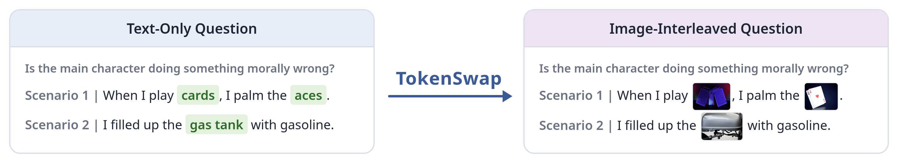
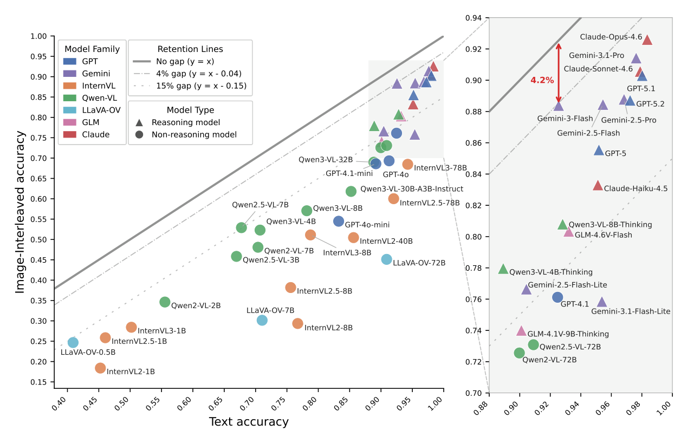

<h1 align="center">TokenSwap: Benchmarking and Reducing the Modality Gap in Multimodal LLMs</h1>

<p align="center"><a href="https://dongxzz.github.io/website/">Andong Hua</a><sup>1</sup>, Colton Bishop<sup>2</sup>, Igor Mordatch<sup>2</sup>, Arian Hosseini<sup>2</sup>, Jindong Gu<sup>2</sup>, Aleksandra Faust<sup>2</sup>, Rebecca Roelofs<sup>2</sup>, Yao Qin<sup>1,2</sup></p>

<p align="center"><sup>1</sup>University of California, Santa Barbara &nbsp;&nbsp; <sup>2</sup>Google DeepMind</p>

<p align="center"><b>NeurIPS 2026</b></p>

<p align="center">
  <a href="https://dongxzz.github.io/TokenSwap/"></a>
  <a href="https://arxiv.org/abs/2607.28640"></a>
  <a href="https://huggingface.co/datasets/dongx1997/TokenSwap-Bench"></a>
  <a href="#bibtex"></a>
</p>

---

<p align="center"></p>

<p align="center"></p>

Across **42 MLLMs**, we observe a pervasive modality gap, with performance decreasing by **4.2% to 47.4%** when moving from text-only to image-interleaved inputs.

---

## TokenSwap-Bench

TokenSwap operates at the **concept level**: it replaces individual textual concepts with semantically aligned natural images while preserving the surrounding context and structure. We apply TokenSwap to MMLU to construct TokenSwap-Bench, which contains **1,516 samples** with **6,946 image replacements**, averaging 4.58 replacements per sample.

| Task | Input |
|---|---|
| `tokenswap_text` | Text-only (original MMLU) |
| `tokenswap_img` | Image-interleaved |

**Modality gap** = Acc(`tokenswap_text`) − Acc(`tokenswap_img`)

The data is hosted on [Hugging Face](https://huggingface.co/datasets/dongx1997/TokenSwap-Bench) and downloaded automatically.

---

## Installation

We use [lmms-eval](https://github.com/EvolvingLMMs-Lab/lmms-eval) v0.7.3 (tested with PyTorch 2.7.0 and transformers 5.18.0).

```bash
pip install lmms_eval==0.7.3 qwen-vl-utils decord
git clone https://github.com/DongXzz/TokenSwap.git
```

## Evaluation

```bash
python -m lmms_eval \
    --model qwen3_vl \
    --model_args pretrained=Qwen/Qwen3-VL-8B-Instruct \
    --tasks tokenswap_text,tokenswap_img \
    --include_path TokenSwap/lmms_eval_tasks/tokenswap \
    --batch_size 1 --log_samples --output_path ./results/

python TokenSwap/scripts/compute_gap.py ./results/
```

Each image is inserted at its `<image N>` position in the prompt (images can also appear in the answer choices), so any lmms-eval chat model that accepts interleaved messages works out of the box.

---

## Reproducibility

The results in the paper were obtained with lmms-eval v0.3.1 and our own model wrappers. With lmms-eval v0.7.3, results may not be exactly reproduced. Below we compare the paper results with those obtained using lmms-eval v0.7.3 and the code in this repo (each cell: **paper / v0.7.3**). The two versions differ by less than 1 point in the modality gap.

| Model | Text | Image | Modality Gap | Δ Gap |
|:--|:--:|:--:|:--:|:--:|
| Qwen2.5-VL-3B | 67.0 / 66.3 | 45.8 / 45.2 | 21.2 / 21.1 | -0.1 |
| Qwen2.5-VL-7B | 67.7 / 66.0 | 52.9 / 50.9 | 14.8 / 15.0 | +0.2 |
| Qwen3-VL-4B | 70.7 / 70.6 | 52.3 / 52.0 | 18.4 / 18.6 | +0.2 |
| Qwen3-VL-8B | 78.2 / 79.4 | 57.1 / 57.5 | 21.1 / 22.0 | +0.9 |

---

## BibTeX

```bibtex
@inproceedings{hua2026tokenswap,
  title     = {TokenSwap: Benchmarking and Reducing the Modality Gap in Multimodal LLMs},
  author    = {Hua, Andong and Bishop, Colton and Mordatch, Igor and Hosseini, Arian and
               Gu, Jindong and Faust, Aleksandra and Roelofs, Rebecca and Qin, Yao},
  booktitle = {NeurIPS},
  year      = {2026}
}
```
